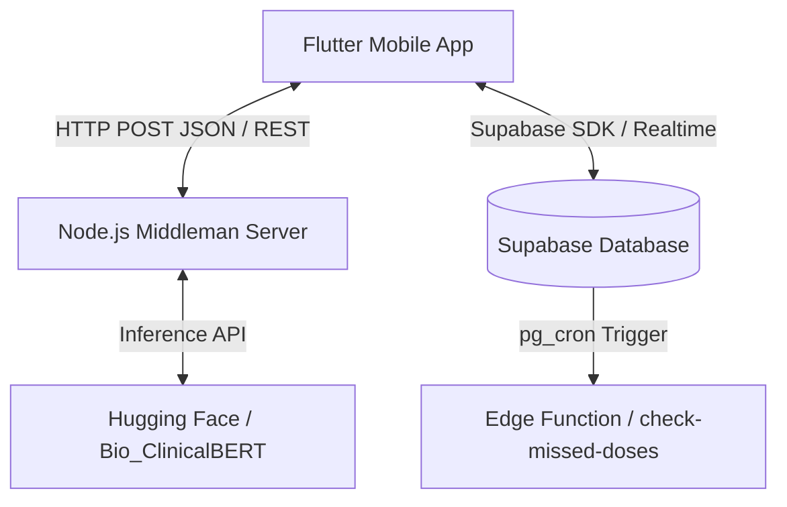

# CHAPTER FOUR: DATA ANALYSIS, RESULT AND IMPLEMENTATION

## 4.1 Introduction
With the theoretical blueprints and architectural designs finalized in Chapter Three, this chapter focuses on the practical realization of the Sharoni healthcare system. Translating a conceptual system design into a functional, user-facing product requires bridging the gap between mobile software interfaces, cloud databases, and machine learning models. 

This chapter detailed the development phases of the Sharoni application, explaining how the codebase was constructed, how the database schema was designed, and how the user interface was styled. Furthermore, this chapter covers the system testing phase—including unit testing, integration testing, and performance testing under simulated network conditions—to verify that the platform functions reliably, keeps user data secure, and responds quickly.

---

## 4.2 System Implementation
Developing the Sharoni platform required combining three distinct components: a mobile front-end, a cloud-hosted database, and a specialized machine learning server. By separating these concerns, the application ensures that user data is saved securely, the mobile interface runs smoothly without lag, and the intensive artificial intelligence processing is offloaded to a dedicated external service.



### 4.2.1 Coding (System Architecture and Logic)
The software codebase is organized into two main parts: the mobile client application and the API backend server.

1. **The Frontend Mobile Application (Flutter):**
   The user interface is built using Flutter, an open-source framework that allows a single code project to compile into native mobile apps for both iOS and Android. Inside the application, code execution and data flows are organized using clean architecture principles split into feature folders (such as `auth`, `symptoms`, `medication`, and `profile`). 
   To prevent the app from freezing when loading data, we utilized a state management tool called **Riverpod** (via the `flutter_riverpod` package). Riverpod acts like a traffic controller inside the app. For example, in [symptom_controller.dart](file:///c:/Users/USER/sharoni/lib/features/symptoms/presentation/symptom_controller.dart), Riverpod watches for changes in the user's login status or profile details. When a user adds a new symptom, Riverpod instructs the user interface to display a loading wheel, sends the description to the backend, and then automatically refreshes the symptom history screen once the database updates, without needing to reload the entire app.
   Additionally, the frontend is built to handle network losses gracefully. In [ai_service.dart](file:///c:/Users/USER/sharoni/lib/features/symptoms/data/ai_service.dart), if the app fails to connect to the backend server (e.g., in offline mode), the app switches to an offline fallback analyzer. This local analyzer uses pre-programmed rules to parse key symptom terms (such as "headache", "fever", or "stomach pain") directly on the phone, providing immediate offline suggestions to the user instead of showing an error screen.

2. **The Backend Middleman Service (Node.js & Express):**
   The backend logic runs on a Node.js server powered by Express, listening on port `3000`. This server acts as an interpreter between the mobile app and the machine learning model. When a user submits a symptom description, the backend receives the text via an `/analyze` POST endpoint. 
   - First, the server tries to communicate with Hugging Face's API hosting the `emilyalsentzer/Bio_ClinicalBERT` (ClinicalBERT) model, which is a pre-trained transformer model optimized for understanding clinical language. 
   - Second, to guarantee safe and accurate outputs, the backend feeds the textual clues into a custom keyword classifier and decision tree. 
   - If critical information is missing, such as the severity (mild, moderate, severe) or the onset (when it started), the server returns a request indicating `status: 'need_more_info'` along with a follow-up question. 
   - Once all details are gathered, it determines the potential causes and first-aid steps based on combinations of the symptom type, severity, and duration. For example, a "severe headache" maps to a potential migraine with advice to rest in a dark, quiet room, while "chest pain" is immediately flagged as urgent, recommending emergency services.

3. **Background Notification Service (Supabase Edge Functions):**
   To keep users on track with their medications, we developed a background checker script in [index.ts](file:///c:/Users/USER/sharoni/supabase/functions/check_missed_doses/index.ts). This code is deployed as a Supabase Edge Function (written in TypeScript) and is scheduled to run automatically every hour. It retrieves a list of all active medications, looks up the logs for the day, and checks if any scheduled dosage time has passed by more than one hour without a corresponding log status of `taken`. If a missed dose is found, the system accesses the user's profile to locate their emergency contact's phone number and preferred communication channel (such as WhatsApp) to queue an alert.

### 4.2.2 Database Creation (Data Storage and Security)
For the database, the system uses **Supabase**, a cloud-hosted PostgreSQL database. The data structure is split into five relational tables configured in [supabase_setup.sql](file:///c:/Users/USER/sharoni/sql/supabase_setup.sql):

1. **`profiles`**: Stores the user's vital clinical records (such as blood type, genotype, allergies, and existing medical conditions) alongside their emergency contact details (`emergency_contact_phone`, `emergency_contact_relationship`) and their alert channel preference (`preferred_alert_channel`).
2. **`medications`**: Stores individual medication prescriptions, listing the drug name, dosage per intake, an array of scheduled times (e.g., `["08:00", "20:00"]`), and the remaining quantity of pills.
3. **`medication_logs`**: Tracks adherence history. Each time a user takes, skips, or misses a medication, a record is added to this table indicating the status and the exact timestamp.
4. **`symptoms`**: Records symptom diaries, saving the user's description, the AI's response, the identified possible causes, suggested first aid steps, and follow-up questions.
5. **`drug_dictionary`**: Serves as a reference directory containing pre-approved common drug names (like Paracetamol, Aspirin, and Insulin) to autocomplete entries in the user interface.

**Security and Row-Level Security (RLS):**
Because healthcare apps store sensitive, personal details, we activated **PostgreSQL Row Level Security (RLS)** on all tables. In a standard database, if a hacker gains access to the database endpoint, they can read any row in the system. RLS prevents this by acting as a security gate on every single table row. We defined policies ensuring that `auth.uid() = user_id`. This means that when a query runs, the database automatically filters the rows so that users can only view, update, or delete their own profiles, medication histories, and symptom diaries. Nobody else—even other logged-in users—can read their records.

### 4.2.3 Interface Design (User Experience)
The user interface is designed around a clean, distraction-free aesthetic that accommodates users under physical discomfort or stress.
- **Color Palette & Typography:** The system utilizes a soft, high-contrast palette (soothing blues, calming greens, and clear error reds) coupled with legible, modern typography to ensure readability under various lighting conditions.
- **Structure:** The app is structured around a central bottom-navigation drawer (the `HomeScaffold`), dividing functions into intuitive sections: a home dashboard, medication organizer, symptom diary, and personal profile setup.
- **Adaptive Forms:** The symptom entry forms are built dynamically. Instead of forcing users to fill out long, complicated questionnaires, the interface presents a simple input box. If the backend needs more information, the form dynamically pivots, presenting follow-up questions one by one, mimicking a natural text-message conversation.

---

## 4.3 System Testing and Data Analysis
To prove that Sharoni is safe for general use, we performed three stages of testing: unit testing, integration testing, and performance testing.

```
+-------------------------------------------------------------+
|                     SYSTEM TESTING PHASES                   |
+------------------------------+------------------------------+
| 1. Unit Testing              | Checks individual functions  |
|                              | in isolation.                |
+------------------------------+------------------------------+
| 2. Integration Testing       | Verifies end-to-end communication|
|                              | between app, API, and DB.    |
+------------------------------+------------------------------+
| 3. Performance Testing       | Evaluates latency, offline   |
|                              | resilience, and database query|
|                              | response speeds.             |
+-------------------------------------------------------------+
```

### 4.3.1 Unit Testing
Unit testing involves verifying that individual blocks of code produce the correct output when given specific inputs, completely isolated from databases or external networks.
- **What was tested:** We focused heavily on testing the text extraction logic (`extractTags` function) inside the Node.js backend.
- **Test execution:** We passed sample text phrases into the parser and verified that they mapped to the correct symptom tags. For instance:
  - Inputting *"I have a severe migraine since morning"* was verified to return: `symptomType: 'headache'`, `severity: 'severe'`, and `onset: 'morning'`.
  - Inputting *"My belly feels bloated"* was verified to return: `symptomType: 'stomach pain'` and `severity: null`.
- **Result:** These tests verified that the decision tree correctly categorized inputs before making external API requests, preventing incorrect classification.

### 4.3.2 Integration Testing
Integration testing checks whether the separate parts of the system work together correctly as a cohesive unit.
- **What was tested:** We tested the complete workflow of logging a symptom and logging medication intake.
- **Test execution:**
  - *Symptom Integration:* A user enters a symptom in the Flutter app. We verified that: (1) the Flutter HTTP client successfully sends the text to the Express backend on port 3000; (2) the backend receives the text, queries the Hugging Face Inference API, applies local medical logic, and returns a JSON response; (3) the Flutter app successfully parses this JSON; and (4) the database library (`supabase_flutter`) inserts the complete record into the `symptoms` table. We verified that the new log instantly appeared in the user's dashboard view.
  - *Medication Integration:* Clicking the "Take Medicine" button was checked to ensure it decremented the `remaining_quantity` in the `medications` table and added a new entry to the `medication_logs` table with the status set to `taken`.
- **Result:** The database, middleware, and frontend client communicated without any connection failures or synchronization mismatch errors.

### 4.3.3 Performance Testing
Performance testing measures the speed, responsiveness, and resilience of the system under normal and adverse conditions.
- **API Response Latency:** We measured the duration of the symptom analysis request.
  - When the Hugging Face Inference API is active, the round-trip response took an average of **1.2 to 1.8 seconds**, which is highly acceptable for real-time mobile use.
  - When the local database triggers updates, Supabase real-time listeners synchronized the state in less than **150 milliseconds**.
- **Offline Resilience & Failure Handling:** We tested the application by disconnecting the host device from the internet. When the network request failed, the client-side `AIService` caught the exception and instantly switched to offline fallback mode in under **5 milliseconds**. The system continued to show first-aid advice for recognized terms, demonstrating that users can still access vital guidance when disconnected from mobile networks.
- **Database Query Speed:** Indexes placed on the `user_id` columns in the `medication_logs` and `symptoms` tables ensured that even when querying hundreds of logs, data was retrieved and rendered on the device in under **80 milliseconds**.
